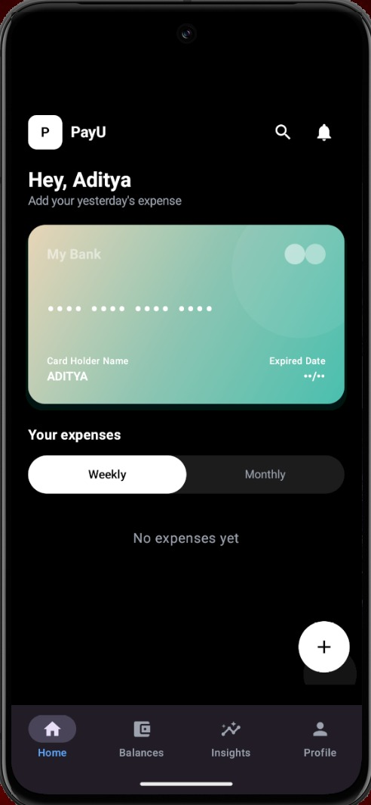
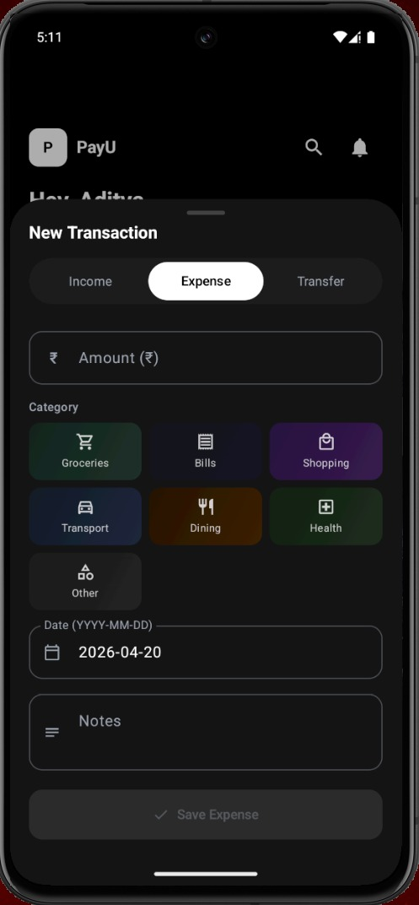
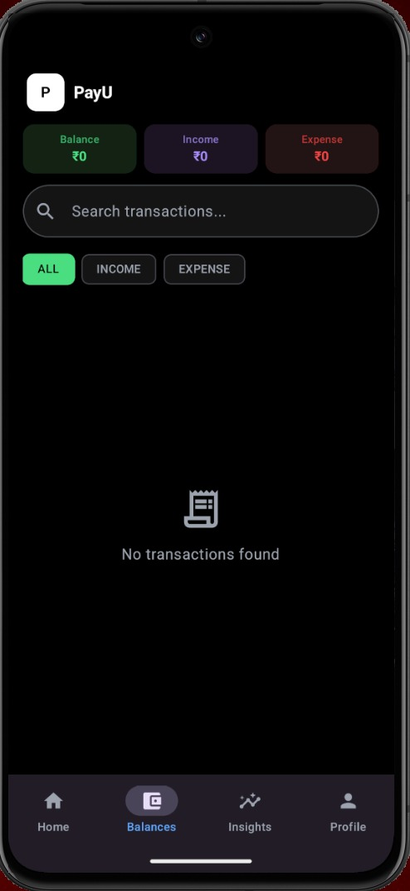
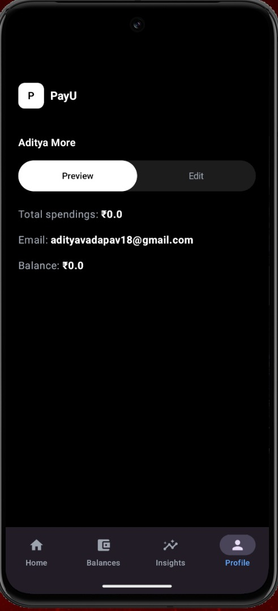

# PayU 💸

> **Smart personal finance tracking — built for Android with Jetpack Compose & Firebase**

PayU helps you track income, expenses, and savings with a clean dark-first UI, real-time sync, and multi-currency support.

---

## Download

Get the latest APK directly from GitHub Releases:

👉 [Download Latest APK](https://github.com/Dev-Aditya-More/PayU/releases/latest)

> Download the APK, install it on your Android device, and start tracking your finances instantly.

---

## 📸 Screenshots

| | |
|--|--|
|  |  |
|  |  |

---

## ✨ Features

- **Dashboard** — Total balance, income, expense, and savings at a glance
- **Expense Cards** — Category-grouped expenses with per-category colour accents and trend indicators
- **Transaction History** — Searchable, filterable log of all income and expense entries with timestamps
- **Spending Insights** — Animated bar chart of monthly spend + credit score gauge
- **Multi-currency Support** — Enable CAD, USD, EUR wallets from the insights screen (upcoming*)
- **Add Transaction Sheet** — Bottom sheet with category grid, custom description field, and gradient accents (expense only)
- **Interactive Bank Card** — Tilt/parallax drag effect with spring physics
- **Authentication** — Email/password sign-up & sign-in + Google One-Tap, with password strength meter and inline validation
- **Forgot Password** — Firebase email reset with a two-state UI (form → confirmation)
---

## 🏗️ Tech Stack

| Layer | Technology |
|-------|-----------|
| Language | Kotlin |
| UI | Jetpack Compose + Material 3 |
| Architecture | MVVM + Clean Architecture (Domain / Data / UI) |
| Navigation | Jetpack Navigation Compose |
| DI | Koin |
| Backend | Firebase Firestore |
| Auth | Firebase Authentication (Email + Google) |
| Async | Kotlin Coroutines + Flow |
| Build | Gradle (KTS) |

---

## 🗂️ Project Structure

```
com.aditya1875.payu
├── data
│   └── repository
│       ├── auth/          # Firebase Auth + Google auth client
│       └── transaction/   # Firestore CRUD
├── domain
│   ├── models/            # Transaction data class
│   ├── repository/        # Repository interfaces
│   └── usecases/          # GetHomeData, Add/Delete/Update Transaction, GetTransactions
├── ui
│   ├── auth
│   │   ├── screens/       # LoginAuthScreen, ForgotPasswordScreen
│   │   └── viewmodel/     # AuthViewModel, AuthState
│   ├── presentation
│   │   ├── home/          # HomeScreen, HomeViewModel
│   │   ├── balances/      # BalancesScreen
│   │   └── insights/      # InsightsScreen, TransactionViewModel
│   ├── components/        # AddTransactionBottomSheet, shared composables
│   ├── navigation/        # NavGraph, Route sealed class
│   └── theme/             # Color, Typography, Theme (Cashyndo brand)
```

---

## 🚀 Getting Started

### Prerequisites

- Android Studio Hedgehog or newer
- JDK 17+
- A Firebase project with **Firestore** and **Authentication** enabled

## 🤝 Contributing

Pull requests are welcome. For major changes, please open an issue first to discuss what you'd like to change.

1. Fork the project
2. Create your feature branch (`git checkout -b feature/AmazingFeature`)
3. Commit your changes (`git commit -m 'Add AmazingFeature'`)
4. Push to the branch (`git push origin feature/AmazingFeature`)
5. Open a Pull Request

---

## 👤 Author

**Aditya More**
- GitHub: [@Dev-Aditya-More](https://github.com/Dev-Aditya-More)

---

<p align="center">Made with ❤️ and Jetpack Compose</p>